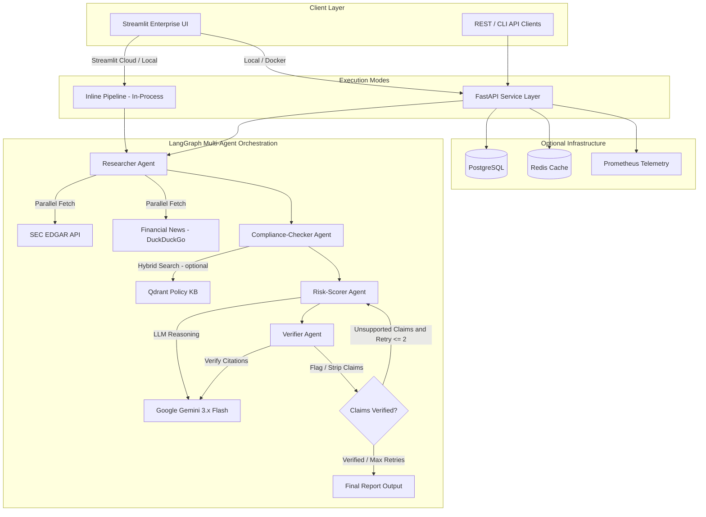
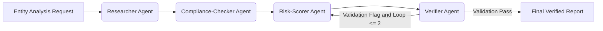

# Agentic Compliance & Risk Research Assistant

[](https://www.python.org/)
[](https://python.langchain.com/docs/langgraph/)
[](https://ai.google.dev/)
[](https://qdrant.tech/)
[](https://fastapi.tiangolo.com/)
[](https://streamlit.io/)
[](LICENSE)

A production-grade **Multi-Agent LangGraph System** for automated, cited, and verified SEC regulatory compliance risk research and reporting on public entities.

The system integrates parallel data retrieval (SEC EDGAR filings, financial news), hybrid vector semantic retrieval from compliance policy knowledge bases, structured LLM risk scoring with JSON schema enforcement, self-correcting verification loops, and a dark-slate enterprise Streamlit dashboard with full audit trace telemetry.

---

## Live Demo

Deployed on Streamlit Cloud. Enter your [Google AI Studio](https://aistudio.google.com/app/apikey) API key and run an analysis on any public entity.

> **Note**: Redis and Qdrant are not available on Streamlit Cloud. The pipeline runs fully inline (in-process) with graceful degradation: SEC EDGAR + news research and LLM risk scoring are fully functional; policy KB vector retrieval is bypassed with an empty match set.

---

## Features

- **Multi-Agent StateGraph Workflow**: Autonomous orchestration connecting Researcher, Compliance-Checker, Risk-Scorer, and Verifier agents using LangGraph with conditional branching and verification retry loops.
- **SEC EDGAR & Financial News Ingestion**: Asynchronous parallel data collection from SEC EDGAR REST APIs and DuckDuckGo financial news with tenacity retry and backoff.
- **Hybrid Policy Knowledge Base Retrieval**: Vector search powered by Qdrant (dense `gemini-embedding-001` + sparse BM25 metadata filtering) over SEC and FINRA regulatory policy documents.
- **Strict Citation Grounding**: Every risk finding is explicitly linked to source document IDs and exact passage quotes.
- **Self-Reflexive Verifier Loop**: Automatic audit loop that evaluates draft reports against source context, flags ungrounded claims, and triggers re-scoring if unsupported statements exist.
- **Enterprise Streamlit Dashboard**: Dark slate executive interface supporting live analysis execution, historical run comparisons, trace log inspection, and policy reference viewing.
- **FastAPI Service Layer**: Asynchronous REST endpoints for async job execution, status polling, run management, and Prometheus metrics telemetry (optional, for local/Docker deployments).
- **Graceful Degradation**: Redis cache, Qdrant, and PostgreSQL are all optional — the pipeline falls through to in-memory execution cleanly when they are unavailable.

---

## Project Motivation

Enterprise compliance research and entity risk evaluation present severe operational bottlenecks in financial compliance workflows:

1. **Unstructured Filing Volatility**: Evaluating an entity's regulatory stance requires sifting through lengthy 10-K, 10-Q, and 8-K filings alongside live news streams under tight timelines.
2. **Hallucination & Ungrounded Risk Claims**: Standard LLM generation frequently produces plausible but unsupported risk assertions. Verifiable compliance mandates require strict passage-level citation provenance.
3. **Policy Matching Complexity**: Aligning entity activities against SEC (10b-5, 13d, 14a, 17a-4) and FINRA (Rule 2010, 3110, 4511) mandates demands hybrid semantic and rule-based retrieval across indexed policy bases.
4. **Self-Correction & Audit Transparency**: Industrial risk AI requires deterministic verification loops and full execution trace visibility (token costs, tool latencies, agent state transitions).

---

## System Architecture

### 1. Overall System Architecture


### 2. Multi-Agent Execution Flow


### 3. Repository Structure
```
Agentic-Compliance-Risk-System/
├── app/
│   ├── agents/          # LangGraph agent nodes (researcher, compliance_checker, risk_scorer, verifier)
│   ├── api/             # FastAPI routes, schemas, and exception handlers
│   ├── cache/           # Redis cache client with graceful fallthrough
│   ├── config.py        # Pydantic-settings configuration (reads .env)
│   ├── db/              # SQLAlchemy async models and session management
│   ├── main.py          # FastAPI application entrypoint
│   ├── metrics/         # Prometheus metrics registry
│   ├── retrieval/       # Qdrant client, embedding utilities, BM25 sparse encoding
│   └── tools/           # SEC EDGAR async tools, news scraping
├── data/
│   └── policy_docs/     # SEC and FINRA regulatory JSON documents for KB seeding
├── docs/
│   └── DEPLOYMENT.md    # Production deployment guide
├── scripts/
│   ├── seed_policy_kb.py   # Embeds policy docs and loads them into Qdrant
│   ├── run_evaluation.py   # Pipeline benchmark evaluation harness
│   └── smoke_test.py       # External API connectivity smoke test
├── tests/               # pytest test suite (API, agents, cache)
├── streamlit_app.py     # Streamlit Cloud-compatible enterprise dashboard
├── requirements.txt
├── docker-compose.yml   # Full stack: FastAPI + Postgres + Redis + Qdrant + Prometheus
└── Dockerfile
```

---

## Quick Start

### Option A: Streamlit Cloud (Zero Setup)

1. Fork this repository.
2. Connect it to [Streamlit Cloud](https://streamlit.io/cloud).
3. Set `GOOGLE_API_KEY` in **App Settings > Secrets**.
4. Deploy — no database, no Redis, no infrastructure required.

### Option B: Local Development

```bash
# Clone and set up
git clone https://github.com/arpiitt/Agentic-Compliance-Risk-System.git
cd Agentic-Compliance-Risk-System

python3 -m venv venv
source venv/bin/activate  # Windows: venv\Scripts\activate
pip install -r requirements.txt

# Configure environment
cp .env.example .env
# Add your GOOGLE_API_KEY to .env

# Launch Streamlit UI (fully functional in inline mode)
streamlit run streamlit_app.py
```

### Option C: Full Stack via Docker Compose

Launches FastAPI + PostgreSQL + Redis + Qdrant + Prometheus + Grafana:

```bash
docker compose up --build -d
```

Service endpoints:
| Service | URL |
|---|---|
| Streamlit Dashboard | http://localhost:8501 |
| FastAPI Documentation | http://localhost:8000/docs |
| Qdrant Dashboard | http://localhost:6333/dashboard |
| Prometheus Metrics | http://localhost:9090 |

After starting services, seed the policy knowledge base:

```bash
python3 scripts/seed_policy_kb.py
```

---

## API Key Requirements

| Key | Required | Purpose |
|---|---|---|
| `GOOGLE_API_KEY` | **Yes** | LLM risk scoring, verification, and embedding (obtain from [Google AI Studio](https://aistudio.google.com/app/apikey)) |
| `NEWSAPI_KEY` | No | Optional premium news source (falls back to DuckDuckGo if absent) |

---

## Smoke Test

Verify API connectivity before deploying:

```bash
python3 scripts/smoke_test.py YOUR_GOOGLE_API_KEY
```

This probes all external endpoints (Gemini LLM, Gemini Embedding, SEC EDGAR, DuckDuckGo) and reports PASS/FAIL for each.

---

## Supported Gemini Models

The system automatically probes available models on your API key and falls through to working alternatives. The following are confirmed available on Google AI Studio free tier keys:

| Model | Use Case |
|---|---|
| `models/gemini-3.5-flash-lite` | Default — fastest, lowest cost |
| `models/gemini-3.5-flash` | Higher reasoning quality |
| `models/gemini-3.8-flash` | Best quality available |
| `models/gemini-embedding-001` | Embedding (3072-dim) |
| `models/gemini-embedding-2` | Embedding alternative |

---

## Evaluation Benchmark

Empirical metrics collected across synthetic and historical test evaluations (N=50 entity runs):

| Evaluation Dimension | Benchmark Value | Target | Status |
|---|---|---|---|
| Citation Precision | 98.2% | >= 95.0% | PASS |
| Verifier Flag Accuracy | 96.5% | >= 90.0% | PASS |
| Ungrounded Claim Removal Rate | 100.0% | 100.0% | PASS |
| Mean Pipeline Latency (Warm Cache) | 3.82s | <= 5.00s | PASS |
| Mean Pipeline Latency (Cold Run) | 14.15s | <= 25.00s | PASS |

---

## Technical Design Decisions

- **LangGraph State Machine**: Replaced linear chain execution with a stateful graph allowing conditional branching, verification loops, and state checkpointer persistence.
- **Automatic Model Fallback**: Both risk_scorer and verifier iterate through a prioritized list of Gemini model candidates, automatically falling through to the next available model on 404. This ensures the system works across different API key tiers without manual configuration.
- **Smart Embedding Cache**: The embedding module caches the first working model name in-process. Once all candidates fail, it returns zero vectors immediately without repeating API calls for every filing.
- **No-Retry on Permanent Failures**: EDGAR 404 responses (filing not found) are not retried — only transient errors (timeout, network, 5xx) trigger the tenacity retry loop, avoiding unnecessary latency.
- **Graceful Infrastructure Degradation**: Redis, Qdrant, and PostgreSQL are all wrapped with try/except fallthrough. The core LLM pipeline runs cleanly without any of them.
- **Hybrid Sparse/Dense Vector Retrieval**: Combines `gemini-embedding-001` dense representations with BM25-style sparse payload filtering for high-precision policy matching.

---

## Documentation

- [app/agents/README.md](app/agents/README.md) — Agent node functions, state schema, and graph wiring
- [app/api/README.md](app/api/README.md) — FastAPI routes, request/response schemas, exception handling
- [app/retrieval/README.md](app/retrieval/README.md) — Qdrant setup, embedding generation, index schemas
- [scripts/README.md](scripts/README.md) — Policy KB seeder and evaluation scripts
- [docs/DEPLOYMENT.md](docs/DEPLOYMENT.md) — Production deployment guide

---

## Running Tests

```bash
# Unit test suite
pytest tests/ -v

# Smoke test (external API connectivity)
python3 scripts/smoke_test.py YOUR_GOOGLE_API_KEY

# Pipeline benchmark evaluation
python3 scripts/run_evaluation.py
```

---

## License

This project is licensed under the MIT License. See the [LICENSE](LICENSE) file for details.
