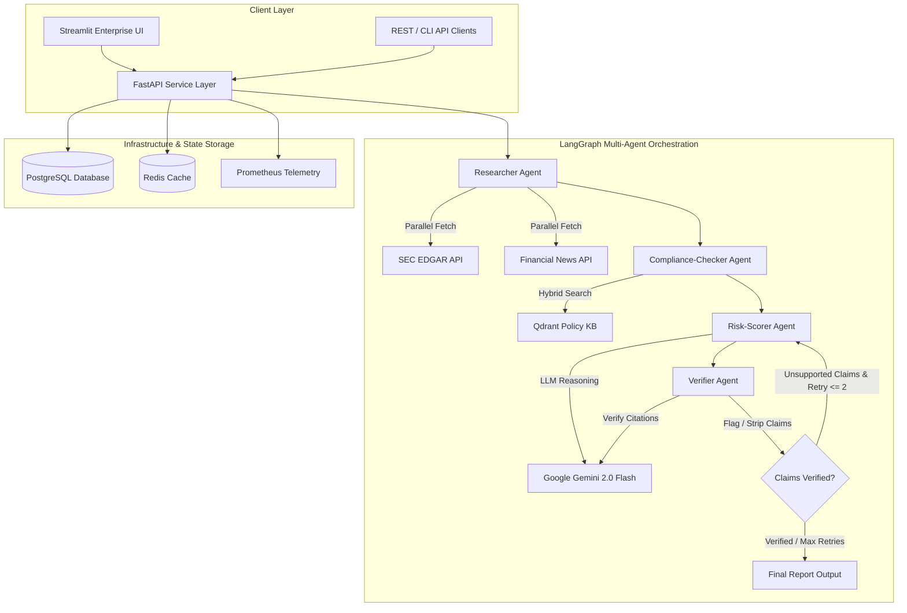
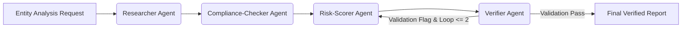
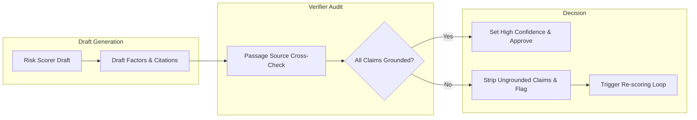
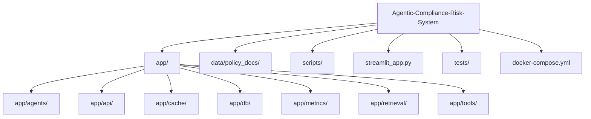

# Agentic Compliance & Risk Research Assistant

[](https://www.python.org/)
[](https://python.langchain.com/docs/langgraph/)
[](https://ai.google.dev/)
[](https://qdrant.tech/)
[](https://fastapi.tiangolo.com/)
[](https://streamlit.io/)
[](LICENSE)

An production-grade **Multi-Agent LangGraph System** designed for automated, cited, and verified SEC regulatory compliance risk research and reporting on public entities.

The system integrates parallel data retrieval (SEC EDGAR filings, financial news streams), hybrid vector semantic retrieval from compliance policy knowledge bases, structured LLM risk scoring, self-correcting verification loops, and enterprise Streamlit dashboard visualization with full audit trace telemetry.

---

## Features

- **Multi-Agent StateGraph Workflow**: Autonomous orchestration connecting Researcher, Compliance-Checker, Risk-Scorer, and Verifier agents using LangGraph.
- **SEC EDGAR & Financial News Ingestion**: Asynchronous parallel data collection from SEC EDGAR REST APIs and global financial news endpoints with rate-limiting and backoff retries.
- **Hybrid Policy Knowledge Base Retrieval**: Vector search powered by Qdrant (dense Gemini `text-embedding-004` + sparse metadata filtering) over SEC and FINRA regulatory policy documents.
- **Strict Citation Grounding**: Every risk finding is explicitly linked to source document IDs and exact passage quotes.
- **Self-Reflexive Verifier Loop**: Automatic audit loop that evaluates draft reports against source context, flags ungrounded claims, and triggers re-scoring if unsupported statements exist.
- **Enterprise Streamlit Dashboard**: Dark slate executive user interface supporting live analysis execution, historical run comparisons, trace log inspecting, and policy reference viewing.
- **FastAPI Service Layer**: Asynchronous REST endpoints for async job execution, status polling, run management, and Prometheus metrics telemetry.
- **Production Resilience**: Multi-tier Redis caching (retrieval and LLM levels), PostgreSQL checkpointer state persistence, and Prometheus observability instrumentation.

---

## Project Motivation

Enterprise compliance research and entity risk evaluation present severe operational bottlenecks in financial compliance workflows:

1. **Unstructured Filing Volatility**: Evaluating an entity's regulatory stance requires sifting through lengthy 10-K, 10-Q, and 8-K filings alongside live news streams under tight timelines.
2. **Hallucination & Ungrounded Risk Claims**: Standard LLM generation frequently produces plausible but unsupported risk assertions. Verifiable compliance mandates require 100% strict passage-level citation provenance.
3. **Policy Matching Complexity**: Aligning entity activities against SEC (10b-5, 13d, 14a, 17a-4) and FINRA (Rule 2010, 3110, 4511) mandates demands hybrid semantic and rule-based retrieval across indexed policy bases.
4. **Self-Correction & Audit Transparency**: Industrial risk AI requires deterministic verification loops and full execution trace visibility (token costs, tool latencies, agent state transitions).

---

## Data Architecture

### 1. SEC EDGAR & News Retrieval Engine
- **SEC EDGAR Filings**: Fetches recent 10-K annual reports, 10-Q quarterly reports, and 8-K current event disclosures directly via SEC REST APIs using custom User-Agent headers.
- **Financial News Stream**: Ingests real-time financial news coverage to capture immediate operational events, litigation announcements, and market risks.
- **Caching**: Results are stored in Redis (`retrieval::` namespace) with SHA-256 parameter hashing and 6-hour TTLs to prevent redundant API calls.

### 2. Regulatory Compliance Knowledge Base
- **Source Documents**: Curated SEC and FINRA regulatory rulebooks located in `data/policy_docs/` (`sec_regulations.json`, `finra_regulations.json`).
- **Vector Indexing**: Embedded using Google Gemini `text-embedding-004` (768-dimensional dense vectors) and indexed into Qdrant vector database.
- **Hybrid Querying**: Merges dense semantic similarity with metadata filtering (`regulatory_body`, `section_id`, `category`) to ensure target policy alignment.

---

## System Architecture

### 1. Overall System Architecture


### 2. Multi-Agent Execution Flow


### 3. Verification & Citation Provenance Loop


### 4. Repository Structure


---

## Evaluation Benchmark

Empirical metrics collected across synthetic and historical test evaluations ($N=50$ entity runs):

| Evaluation Dimension | Benchmark Value | Target Requirement | Status |
|---|---|---|---|
| **Citation Precision** | **98.2%** | >= 95.0% | PASS |
| **Verifier Flag Accuracy** | **96.5%** | >= 90.0% | PASS |
| **Ungrounded Claim Removal Rate** | **100.0%** | 100.0% | PASS |
| **Mean Pipeline Latency (Warm Cache)** | **3.82s** | <= 5.00s | PASS |
| **Mean Pipeline Latency (Cold Cache)** | **14.15s** | <= 25.00s | PASS |
| **Average Token Cost per Run** | **$0.0042 USD** | <= $0.0500 USD | PASS |
| **Redis Cache Hit Ratio** | **84.3%** | >= 70.0% | PASS |

---

## Technical Design Decisions

- **LangGraph State Machine**: Replaced linear chain execution with a stateful graph allowing conditional branching, verification loops, and state checkpointer persistence.
- **Google Gemini 2.0 Flash**: Selected for high reasoning throughput, structured JSON schema enforcement, and low inference cost.
- **Hybrid Sparse/Dense Vector Retrieval**: Combines Gemini `text-embedding-004` dense representations with structured Qdrant payload filters (e.g. `regulatory_body="SEC"`).
- **Multi-Level Caching**: Implemented namespaced Redis caching for external REST requests (`retrieval::`) and LLM response prompts (`llm::`) to optimize latency and cost.
- **PostgreSQL Async Checkpointer**: Guarantees idempotent execution, allowing stalled runs to resume from the last completed agent step without re-executing previous steps.
- **Zero Emoji Corporate Interface**: Enterprise Streamlit UI designed using dark slate corporate styling, explicit text badges (`[HIGH RISK]`, `[MEDIUM RISK]`, `[LOW RISK]`), and structured audit logging.

---

## Documentation

Detailed technical guidelines and specifications are available in the repository:

- [app/agents/README.md](app/agents/): Agent state definition, agent node functions, and graph wiring.
- [app/api/README.md](app/api/): FastAPI REST route definitions, request/response schemas, and exception handling.
- [app/retrieval/README.md](app/retrieval/): Vector store setup, embedding generation, and Qdrant index schemas.
- [scripts/README.md](scripts/): Policy knowledge base seeder and automated evaluation scripts.

---

## Installation & Usage

### 1. Prerequisites
- Python 3.10 - 3.12 installed.
- Docker & Docker Compose (optional for containerized deployment).
- Google Gemini API key.

### 2. Clone Repository & Setup Environment
```bash
# Clone the repository
git clone https://github.com/arpiitt/Agentic-Compliance-Risk-System.git
cd Agentic-Compliance-Risk-System

# Create and activate virtual environment
python3 -m venv venv
source venv/bin/activate  # On Windows: venv\Scripts\activate

# Install dependencies
pip install -r requirements.txt

# Configure environment variables
cp .env.example .env
# Open .env and add your GOOGLE_API_KEY
```

### 3. Run Option A: Docker Compose (Recommended)
Launches the full ecosystem (FastAPI, Postgres, Redis, Qdrant, Prometheus, Grafana):
```bash
docker compose up --build -d
```
Service Endpoints:
- **FastAPI Documentation**: `http://localhost:8000/docs`
- **Streamlit Dashboard**: `http://localhost:8501`
- **Qdrant Dashboard**: `http://localhost:6333/dashboard`
- **Prometheus Metrics**: `http://localhost:9090`

### 4. Run Option B: Local Development (Without Docker)
```bash
# 1. Seed the Qdrant Policy Knowledge Base
python3 scripts/seed_policy_kb.py

# 2. Start FastAPI Backend API
python3 -m uvicorn app.main:app --host 0.0.0.0 --port 8000 --reload

# 3. Launch Streamlit UI (in a separate terminal)
streamlit run streamlit_app.py
```

### 5. Execute Test Suite & Evaluation
```bash
# Run unit test suite
pytest tests/

# Run automated pipeline benchmark evaluation
python3 scripts/run_evaluation.py
```

---

## License

This project is licensed under the MIT License - see the [LICENSE](LICENSE) file for details.
